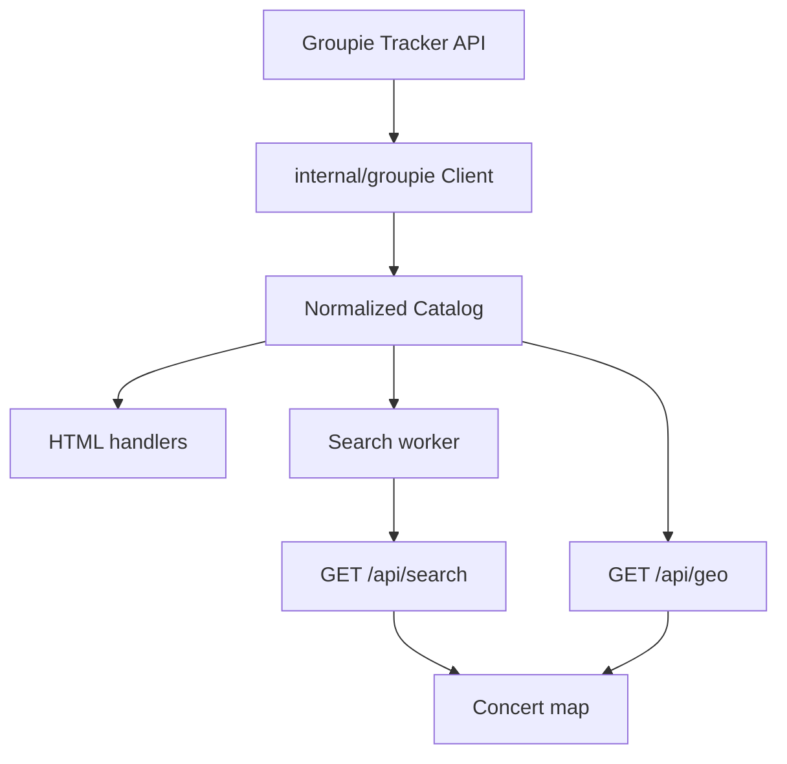

# Architecture - Groupie Tracker

## 1. Overview

The app is a standard-library Go HTTP server. It loads the Groupie Tracker API
at startup, normalizes the four resources into an in-memory catalog, and serves
HTML pages, CSS/JS assets, a JSON search endpoint, and a JSON geolocalization
endpoint. The frontend is plain HTML, CSS, and JavaScript, with CSS carrying the
visualization-focused presentation required by the bonus subject.

## 2. Data Flow

## 3. Packages

- `main`: process setup, API load, worker lifecycle, geo service wiring, HTTP server startup, graceful shutdown.
- `internal/groupie`: API structs, HTTP client, catalog join logic, search matching, async search worker.
- `internal/geo`: geocoding (Nominatim client over net/http) plus a caching, rate-limited service with an embedded seed cache.
- `internal/web`: HTTP routing, embedded static assets, HTML pages, JSON endpoints, error handling, and CSS/JS delivery.

## 4. Routes

- `GET /`: home page with artist catalog, search form, and filter/sort toolbar.
- `GET /artist/{id}`: artist detail page (facts header, member chips, concert map, concerts list).
- `GET /api/search`: client-server event endpoint returning JSON. Accepts `q`,
  `sort`, `minYear`, `maxYear`, `minAlbumYear`, `maxAlbumYear`, `minMembers`,
  `maxMembers`, `country`, and repeated `location`.
- `GET /api/geo?id=`: geolocalization endpoint returning an artist's concerts as date-ordered map points.
- `GET /healthz`: health check for deployment.
- `/static/*`: embedded CSS and JavaScript assets.

## 5. Async Event Design

Search, filter, and sort requests enter `GET /api/search`, which parses the query parameters into a `SearchQuery`, creates a timeout-bound context, and sends it to `SearchWorker`. The worker runs in a goroutine and communicates through channels. It filters and sorts the immutable in-memory catalog and replies through a per-request response channel. The browser uses one response to update both the autocomplete dropdown and the catalog grid. Closing the worker shuts down the goroutine safely.

## 5a. Visualization and CSS Design

The home page visualizes the dataset with artist cards, image thumbnails,
summary chips, live result counts, a search combobox, and filter/sort controls.
The detail page visualizes one artist with a facts header, member chips, a
concert map, and a readable concert list.

`internal/web/static/site.css` defines the responsive theme, background visual
layer, card and panel styles, form states, focus indicators, reduced-motion
handling, and mobile breakpoints. The 404/405/500 pages reuse the same CSS so
error states are covered by the visual design.

## 5b. Geolocalization Design

The artist page requests `GET /api/geo?id=`. The handler looks up the artist, then resolves each `city-country` location to coordinates through `internal/geo`. The geo service caches every result (and failures), serializes and rate-limits live geocoding calls to respect Nominatim's policy, and is warmed at startup by an embedded seed cache (`seed.json`) so known locations resolve without a network call. Concerts are returned ordered by their earliest date. In the browser, Leaflet renders one marker per concert and a dashed polyline through them in date order to trace the tour path.

## 6. Error Handling

- API client returns errors for failed requests and non-2xx statuses.
- Unknown routes and bad artist IDs return a friendly 404 page.
- Search failures return a friendly 500 page.
- Panic recovery protects the server from unexpected handler crashes.
- Graceful shutdown stops the HTTP server and search worker.

## 7. Testing Strategy

- API client tests use `httptest.Server`.
- Catalog tests verify audit examples and search behavior.
- Worker tests verify async search, cancellation, timeout, and closed-worker behavior.
- Web tests verify home/detail rendering, search JSON, geo JSON, static CSS,
  404, 405, 500, and health responses.
